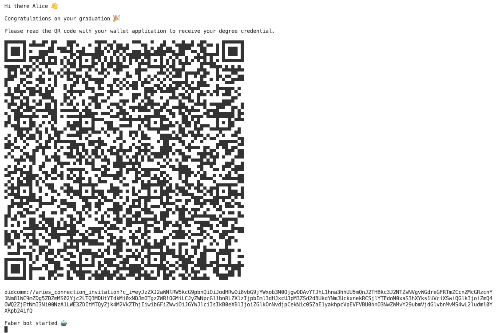
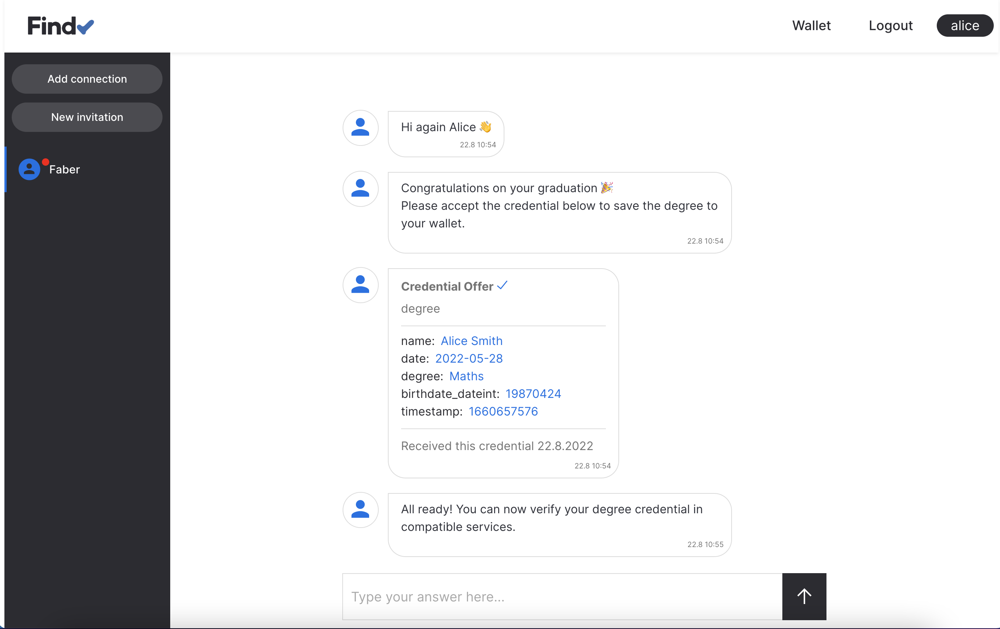
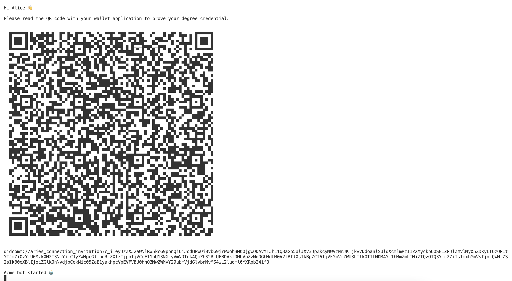
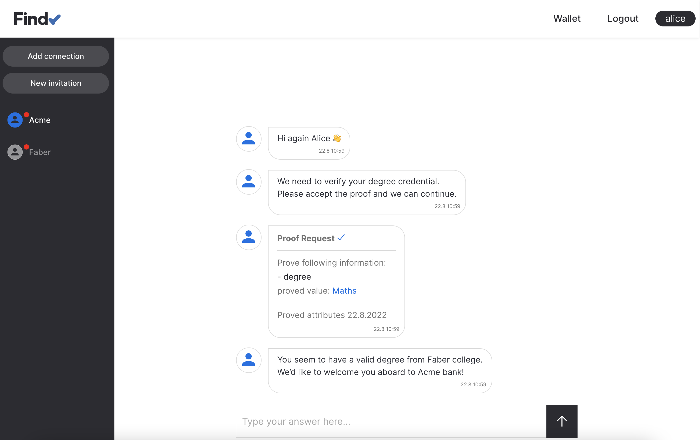

# Findy Agency Demo

## Prerequisities

1. Setup agency to localhost according to [instructions](https://github.com/findy-network/findy-wallet-pwa/tree/dev/tools/env#agency-setup-for-local-development).
Define following environment variables:

    ```bash
    export FCLI_TLS_PATH="/path/to/findy-wallet-pwa/tools/env/config/cert"
    ```

    **OR**

1. Use cloud installation for agency. Define following environment variables:

    ```bash
    export FCLI_SERVER="agency-api.example.com:50051"
    export FCLI_TLS_PATH="/path/to/cert"
    export FCLI_ORIGIN="https://agency.example.com"
    export FCLI_URL="https://agency.example.com"
    ```

2. [Install findy-agent-cli](https://github.com/findy-network/findy-agent-cli#Installation)
3. Install qrencode

    Mac:

    ```bash
    brew install qrencode
    ```

## Alice-Faber-Acme Demo

After completing her education at Faber College, Alice is going to apply for
a job at Acme Inc.
To do this she must provide proof of education.

This demo shows some basic features of Findy Agency:

* Individuals (Alice) **registering and logging in to web wallet** using
their device authenticator
* Individuals using web wallet for **receiving and proving credentials**
* Agency-hosted agents being manipulated with **findy-agent-cli tool**
* Running **simple chat bots** capable of utilizing credentials in their dialog
flows with the CLI tool

### Steps

1. Alice registers and logs in to web wallet
    * Open web wallet with browser: <http://localhost:3000> (or cloud installation)
    * Choose unique user name for Alice and register to web wallet.
    * Use chosen user name and log in to web wallet.

    

1. Alice connects with Faber
    * Start Faber bot by running script: `./faber/run.sh`
    * Open "Add connection" dialog in web wallet and read
    the QR code displayed by Faber bot
    (or copy-paste the invitation url).

    

1. Faber issues credential to Alice
    * Accept the credential in web wallet view.

    

1. Alice connects with Acme
    * Open new terminal and start Acme bot by running script: `./acme/run.sh`
    * Read the QR code displayed by Acme bot with web wallet
    (or copy-paste the invitation to Add connection -dialog).
    * Accept the proof request in web wallet view.

    

1. Acme verifies Alice's degree credential.
    * All done, Alice can now continue the recruitment process.

    
